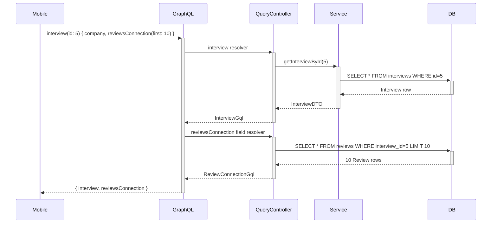
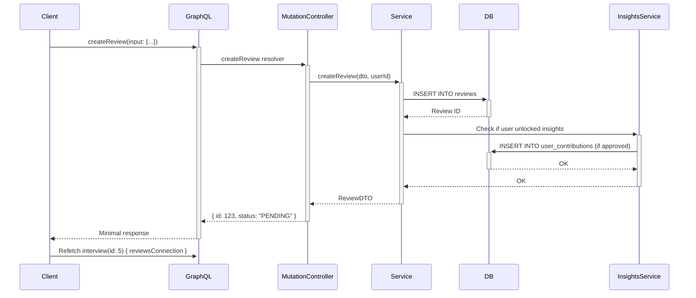

# Architecture Documentation

**Rate My Interview** — Full-stack interview experience platform

Last updated: 2025-12-27

---

## System Overview

```
┌─────────────────────────────────────────────────────────────┐
│                        Clients                              │
├──────────────────┬──────────────────┬──────────────────────┤
│   Next.js Web    │  iOS/Android     │   Future Clients     │
│   (React 19)     │  (React Native)  │                      │
└────────┬─────────┴────────┬─────────┴──────────────────────┘
         │                  │
         └──────────┬───────┘
                    │ GraphQL over HTTPS
         ┌──────────▼──────────────────────────────────────┐
         │   Spring GraphQL Server (Java 17)               │
         │   • Query resolvers                             │
         │   • Mutation resolvers                          │
         │   • Field resolvers (lazy loading)              │
         │   • Auth middleware                             │
         └──────────┬──────────────────────────────────────┘
                    │
         ┌──────────▼──────────────────────────────────────┐
         │   PostgreSQL Database                           │
         │   • Interviews                                  │
         │   • Reviews (moderated)                         │
         │   • Users, Sessions                             │
         │   • User contributions (insights gating)        │
         └─────────────────────────────────────────────────┘
```

---

## Tech Stack

### Frontend

| Layer | Technology | Version |
|-------|------------|---------|
| Framework | Next.js | 16.1.1 |
| React | React | 19.2.3 |
| Language | TypeScript | 5.x (strict mode) |
| Styling | Tailwind CSS | v4 |
| GraphQL Client | Custom (fetch-based) | - |
| Deployment | Vercel | - |

**Production URL:** https://hello-world-five-peach.vercel.app

### Backend

| Layer | Technology | Version |
|-------|------------|---------|
| Framework | Spring Boot | 3.2.1 |
| GraphQL | Spring GraphQL | (Spring Boot starter) |
| Language | Java | 17 |
| ORM | JPA/Hibernate | (Spring Data JPA) |
| Database | PostgreSQL | 15+ |
| Auth | Spring Security | (Session + JWT support) |
| Deployment | Fly.io | Docker container |

**Production URL:** https://rate-my-teacher-api.fly.dev

---

## GraphQL Architecture

### Core Principles

1. **Single Schema** — No schema forks for web vs mobile
2. **GraphQL-First** — All reads via GraphQL (REST deprecated)
3. **Minimal Responses** — Mutations return `{id, status}`, client refetches
4. **Nested Types** — GraphQL-idiomatic (not REST-style wrappers)
5. **Field Resolvers** — Lazy-load expensive nested data

### Schema Design Pattern

**Anti-pattern (REST-ish):**
```graphql
type InterviewDetailResponse {
  interview: Interview
  reviews: [Review]
  ratingBreakdown: RatingBreakdown
}
```

**Correct (GraphQL-idiomatic):**
```graphql
type Interview {
  id: ID!
  company: String!
  # ... metadata

  # Nested data (resolved on-demand)
  reviews: [Review!]!
  reviewsConnection(first: Int, after: String): ReviewConnection!
  ratingBreakdown: [RatingCount!]!
}
```

**Why?**
- Web can query all fields
- Mobile can query only metadata
- Same schema, different query documents

---

## Data Flow Patterns

### 1. Interview Detail Page (Read)



**Key insight:** Field resolvers execute ONLY when client queries that field.

### 2. Create Review (Write)



**Why minimal response?**
- Review is PENDING (not visible yet)
- No point returning full review
- Client can refetch if needed

---

## Authentication & Authorization

### Session-Based (Web)

```
Browser → POST /api/auth/start (email)
        ← 200 OK

Browser → POST /api/auth/verify (email, code)
        ← 200 OK + Set-Cookie: SESSION=...

Browser → POST /graphql (query)
        + Cookie: SESSION=...
        ← 200 OK (authenticated)
```

**Implementation:**
- Spring Security session management
- Cookie: `HttpOnly`, `Secure`, `SameSite=Lax`
- Session store: In-memory (for now)

### Token-Based (Mobile)

```
Mobile → POST /api/auth/verify (email, code)
       ← 200 OK + { sessionToken: "..." }

Mobile → POST /graphql (query)
       + Authorization: Bearer <sessionToken>
       ← 200 OK (authenticated)
```

**Implementation:**
- Mobile stores token in secure storage (Keychain/Keystore)
- Backend validates via `AppPrincipal` extraction
- Same session backend, different transport

---

## GraphQL Schema Organization

### File Structure

```
backend/src/main/resources/graphql/
  └── schema.graphqls         # Single unified schema

backend/src/main/java/.../graphql/
  ├── QueryController.java    # Query resolvers + field resolvers
  ├── MutationController.java # Mutation resolvers
  ├── MeControllerGql.java    # User-specific resolvers
  └── model/
      ├── InterviewGql.java
      ├── ReviewGql.java
      ├── ReviewConnectionGql.java  # Pagination
      └── ...
```

### Schema Sections

```graphql
# ────────────────────────────────────────────────
# Queries (Read Operations)
# ────────────────────────────────────────────────
type Query {
  interview(id: ID!): Interview
  interviews(...): InterviewsResponse!
  insights(interviewId: ID!): Insights!
  me: Me
  stats: PlatformStats!
  tags: TagsResponse!
}

# ────────────────────────────────────────────────
# Mutations (Write Operations)
# ────────────────────────────────────────────────
type Mutation {
  createReview(input: CreateReviewInput!): CreateReviewResponse!
  updateReview(id: ID!, input: UpdateReviewInput!): UpdateReviewResponse!
  deleteReview(id: ID!): DeleteResponse!
}

# ────────────────────────────────────────────────
# Core Types
# ────────────────────────────────────────────────
type Interview {
  # Metadata (cheap)
  id: ID!
  company: String!
  role: String!
  averageRating: Float
  reviewCount: Int!

  # Nested data (field resolvers)
  reviews: [Review!]!  # @deprecated: Use reviewsConnection
  reviewsConnection(first: Int, after: String, sort: ReviewSort): ReviewConnection!
  ratingBreakdown: [RatingCount!]!
}

# ────────────────────────────────────────────────
# Pagination Types (Mobile-Optimized)
# ────────────────────────────────────────────────
type ReviewConnection {
  edges: [ReviewEdge!]!
  pageInfo: PageInfo!
  totalCount: Int!
}

type PageInfo {
  hasNextPage: Boolean!
  endCursor: String
}
```

---

## Performance Optimizations

### 1. Cursor-Based Pagination

**Problem:** Interview with 100 reviews = 500KB response

**Solution:**
```graphql
reviewsConnection(first: 10, after: "cursor")
```

**Result:**
- First load: 10 reviews (~50KB)
- 90% payload reduction
- Infinite scroll support

### 2. Field-Level Resolution

**Implementation:**
```java
@SchemaMapping(typeName = "Interview", field = "reviews")
public List<ReviewGql> interviewReviews(InterviewGql interview) {
    // Only executes if client queries this field
    return reviewRepo.findByInterviewIdAndStatus(interview.id(), APPROVED);
}
```

**Benefit:**
- Mobile can skip `reviews` field entirely
- Fetch only `{ company, role, reviewCount }`
- No N+1 queries

### 3. React Cache (Frontend)

```typescript
export const interviewApi = {
  getInterviewById: cache(async (id) => {
    // React dedupes identical requests
    return graphqlRequest(INTERVIEW_QUERY, { id });
  }),
};
```

**Benefit:**
- Multiple components can call same query
- React executes it once per render

---

## Mobile-Specific Patterns

### Query Documents (Not Schema)

**Web Query:**
```graphql
query InterviewDetail($id: ID!) {
  interview(id: $id) {
    company
    role
    reviews { ... }  # All 100 reviews
  }
}
```

**Mobile Query:**
```graphql
query InterviewDetail($id: ID!, $first: Int) {
  interview(id: $id) {
    company
    role
    reviewsConnection(first: $first) {
      edges { node { ... } }
      pageInfo { hasNextPage endCursor }
    }
  }
}
```

**Same schema. Different queries. Zero schema forks.**

### Sorting Support

```graphql
enum ReviewSort {
  RECENT    # createdAt DESC (default)
  HIGHEST   # rating DESC
  LOWEST    # rating ASC
}

reviewsConnection(first: 10, sort: HIGHEST)
```

---

## Contribution-Gated Insights

### Pattern

```graphql
type Insights {
  companyName: String!
  totalReviews: Int!
  locked: Boolean!

  # Only when locked = false
  tagDistribution: [TagDistribution!]
  averageDifficulty: Float
  outcomeDistribution: [OutcomeDistribution!]

  # Only when locked = true
  unlockMessage: String
  topTagsBlurred: [String!]
}
```

### Logic

```java
@QueryMapping
public InsightsGql insights(@Argument Integer interviewId, Authentication auth) {
    String userEmail = getUserEmail(auth);

    if (insightsService.hasUnlockedInsights(userEmail, interviewId)) {
        return mapFullInsights(...);  // locked = false
    }

    return mapPreviewInsights(...);    // locked = true
}
```

**User unlocks insights by:**
1. Submitting a review for that interview
2. Review gets approved by moderator
3. `UserContribution` record created
4. Future queries return full insights

---

## Kill Test Methodology

### What is a Kill Test?

> Disable a REST endpoint. If the page still works, REST is safely removed.

### Example: Interview Detail Page

**Before:**
```
GET /api/interviews/5         ← REST endpoint
POST /graphql { interview(id: 5) }  ← GraphQL query
```

**Kill Test:**
```java
// @GetMapping("/{id}")  ← DISABLED
// public ResponseEntity<InterviewDetailResponse> getInterviewById(...) {
//     -- REMOVED: Use GraphQL instead --
// }
```

**Verify:**
```bash
$ curl /api/interviews/5
→ 500 "No static resource"  ✓

$ curl -X POST /graphql -d '{"query":"query { interview(id: \"5\") { ... } }"}'
→ 200 OK with data  ✓

$ open https://app.com/interviews/5
→ Page loads correctly  ✓
```

**Killed Endpoints:**
- `GET /api/interviews/{id}` (lines 53-60 in InterviewExperienceController.java)
- `GET /api/my/reviews` (lines 49-56 in MeController.java)
- `GET /api/insights/{id}` (entire InsightsController.java)

---

## Error Handling

### GraphQL Errors

**Backend:**
```java
throw new ResourceNotFoundException("Interview", id);
// → GraphQL error with path
```

**Frontend:**
```typescript
try {
  const data = await graphqlRequest(query);
} catch (error) {
  if (error instanceof GraphQLError) {
    // Handle GraphQL errors
  }
  if (error instanceof ApiError && error.status === 401) {
    redirectToLogin();
  }
}
```

### Mutation Validation

**Backend:**
```java
@Valid @RequestBody CreateReviewInput input
// Spring validates constraints
```

**Response:**
```json
{
  "errors": [{
    "message": "comment: size must be between 30 and 5000",
    "path": ["createReview"]
  }]
}
```

---

## Deployment Architecture

### Backend (Fly.io)

```
fly.toml
  → Docker build (Maven + Spring Boot)
  → Deploy to EWR region (New Jersey)
  → Health checks on /actuator/health
  → Auto-scaling (1-2 machines)
```

**Environment:**
- `DATABASE_URL` (PostgreSQL connection string)
- `SPRING_PROFILES_ACTIVE=prod`

### Frontend (Vercel)

```
vercel.json
  → Next.js build (Turbopack)
  → Deploy to Edge network
  → Server-side rendering (dynamic routes)
  → Static generation (marketing pages)
```

**Environment:**
- `NEXT_PUBLIC_API_URL=https://rate-my-teacher-api.fly.dev`

---

## Database Schema (Core Tables)

```sql
-- Interviews
CREATE TABLE interview_experience (
  id SERIAL PRIMARY KEY,
  company VARCHAR(255) NOT NULL,
  role VARCHAR(255) NOT NULL,
  level VARCHAR(50),
  stage VARCHAR(50),
  location VARCHAR(255),
  created_at TIMESTAMP DEFAULT NOW()
);

-- Reviews (moderated)
CREATE TABLE review (
  id SERIAL PRIMARY KEY,
  interview_experience_id INT REFERENCES interview_experience(id) ON DELETE CASCADE,
  author_user_id BIGINT REFERENCES users(id),
  rating INT CHECK (rating >= 1 AND rating <= 5),
  comment TEXT CHECK (LENGTH(comment) >= 30),
  status VARCHAR(20) DEFAULT 'PENDING',  -- PENDING | APPROVED | REJECTED
  approved_at TIMESTAMP,
  created_at TIMESTAMP DEFAULT NOW()
);

-- User contributions (for insights gating)
CREATE TABLE user_contribution (
  id SERIAL PRIMARY KEY,
  user_identifier VARCHAR(255) NOT NULL,  -- email or session hash
  interview_experience_id INT REFERENCES interview_experience(id),
  review_id INT REFERENCES review(id),
  unlocked_at TIMESTAMP DEFAULT NOW(),
  UNIQUE(user_identifier, interview_experience_id)
);
```

---

## Future Enhancements

### Planned (Not Yet Implemented)

- [ ] WebSocket subscriptions for live updates
- [ ] Apollo Client (replace custom fetch client)
- [ ] Persisted queries (APQ)
- [ ] DataLoader for N+1 prevention
- [ ] Redis caching layer
- [ ] GraphQL subscriptions for moderation queue
- [ ] Rate limiting per client
- [ ] GraphQL complexity analysis

### Deferred (Mobile Post-Launch)

- [ ] Offline write queue
- [ ] Optimistic UI for mutations
- [ ] Push notifications
- [ ] Draft mode for reviews

---

## Development Workflow

### Adding a New Feature

1. **Schema First**
   ```graphql
   # Add to schema.graphqls
   type NewFeature { ... }
   ```

2. **Backend Models**
   ```java
   public record NewFeatureGql(...) {}
   ```

3. **Resolver**
   ```java
   @QueryMapping
   public NewFeatureGql newFeature() { ... }
   ```

4. **Frontend Query**
   ```typescript
   export const NEW_FEATURE_QUERY = `...`;
   ```

5. **Kill Test**
   - Disable REST if exists
   - Verify GraphQL works
   - Ship

---

## Troubleshooting

### "Unauthorized" on GraphQL

**Check:**
1. Cookie sent? (`document.cookie`)
2. Session valid? (`GET /api/me`)
3. CORS headers? (Fly.io config)

### "Field not found" Error

**Check:**
1. Schema updated? (`schema.graphqls`)
2. Backend redeployed? (`fly deploy`)
3. Query typo? (field name case-sensitive)

### Pagination returns empty

**Check:**
1. Cursor valid? (Base64 encoded `review:ID`)
2. Sort enum correct? (`RECENT` not `recent`)
3. Reviews exist? (`totalCount` field)

---

## References

- **GraphQL Spec:** https://spec.graphql.org/
- **Spring GraphQL:** https://spring.io/projects/spring-graphql
- **Relay Cursor Spec:** https://relay.dev/graphql/connections.htm
- **Apollo Client (future):** https://www.apollographql.com/docs/react/

---

**Last Modified:** 2025-12-27
**Schema Version:** 1.2 (pagination added)
**Maintainer:** Engineering Team
